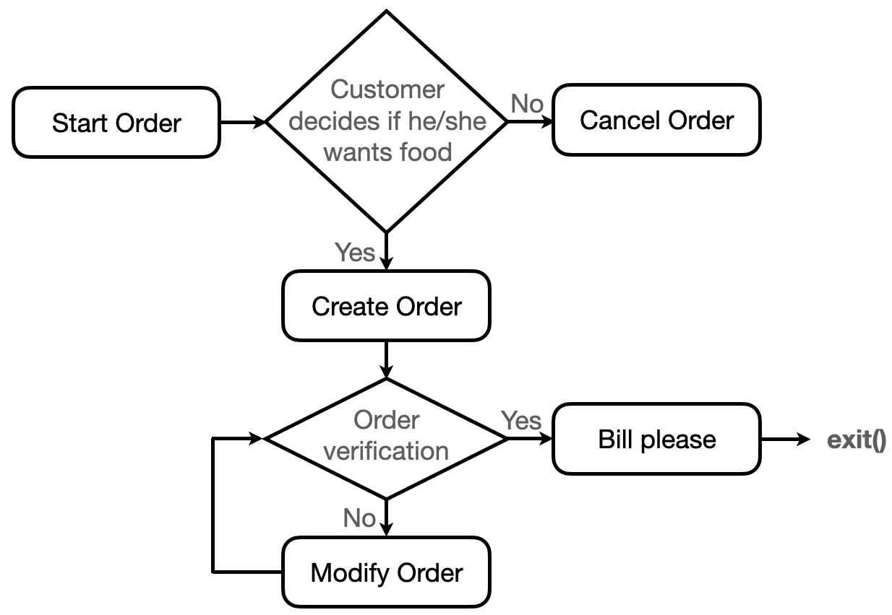

=================
Taking Your Order
=================

Basic information
=================

This is an automatically process and a facial recognition module to a virtual assistant that can take and process orders. 

You can use the following command to checkout from repository:
``git clone https://github.com/yenchanglu/takingYourOrder``

Use following commands for Installation:
``pip install pyttsx3``

``sudo apt-get update && sudo apt-get install espeak``

``sudo apt-get install python3-pyaudio``

Problem to solve
================

It often feels like everything in our lives is designed to make the world move faster. An example of this modern impatience is the drive-thru: people became frustrated with waiting in slow drive-thru line. Why "fast food" restaurant speed of customer order processing is getting slow? Because it is still being done today as they were 50 years ago. This project is working on a way for modernizing the drive-thru, reducing unnecessary procedures and waiting time. It can also free up restaurant staff to focus on tasks that increase throughput.

Perspective users
=================

Clerk doesn't need to enter orders into POS and announce the total, receive payment and give change to customer anymore. Clerk just receives order and gives order to customer with this system. For hungry and thirsty people, it will make waiting in line less-annoying.

System architecture
===================

API description
===============

``welcome:: To set up an order``

``process_order:: To enter order into POS``

``order_verification:: To check if order is correct`` 

``modify_order:: To modify the order``

``cancel_order:: To cancel the order``

``bill_please:: To announce the total``

C++ wrapper API
===============

``std::pair<std::vector<double>, Matrix> eigenface(Matrix *mat)``

``std::vector<std::vector<double> > load_data()``

``std::vector<double> read_pgm(std::ifstream &file)``

``void write_pgm(std::string file, Matrix *img)``

``size_t recognition(Matrix X, Matrix M, Matrix U, Matrix W)``

Engineering infrastructure
==========================

The system uses C++ and Python for speech/facial recognition and high-level API. This GitHub repository will be setting up continuous integration with GitHub Actions.

Testing framework
__________________

* Unit testing Python code with the unittest module

Schedule
========

* W1 (10/19): Planning, software architecture and development
* W2 (10/26): Studying on speech recognition algorithms
* W3 (11/02): Implementing the speech recognition module
* W4 (11/09): Developing the ordering system
* W5 (11/16): Improving the performance and user experience
* W6 (11/23): Integrating voice orders into the system 
* W7 (11/30): Writing unit tests for C++/Python
* W8 (12/07): Software testing
* W9 (12/14): Debugging and optimizing
* W10 (12/21): Preparing for term project presentation
* W11 (12/28): Term project presentation I
* W12 (1/4): Term project presentation II

References
==========

1. https://github.com/mozilla/DeepSpeech

2. https://creately.com/diagram/example/ikqbnbgp1/McDonalds%20Drive%20Through%20Ordering%20Process

3. https://en.wikipedia.org/wiki/Jacobi_eigenvalue_algorithm
